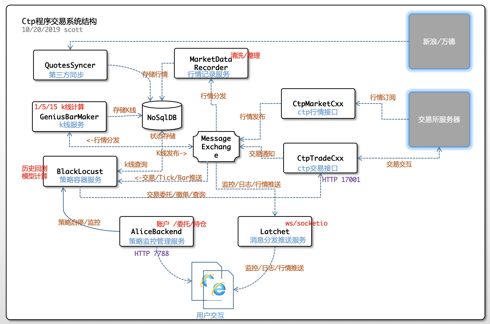

## Tibet 0.6

程序交易系统 0.6 上线版本

系统结构
---


服务说明
-----

### 1. CtpMarketCXX

>   c++版本的ctp行情接收服务程序。将接收到的行情记录通过redis传播.

   行情接收者:
   * CtpMarketDataRecorder
   * GeniusBarMarker
   * 策略实例

#### 2. CtpTradeCxx

>   c++期货交易接口程序，提供http接口供策略调用进行委托、查询等操作。成交回报等消息将通过redis传播。


#### 3. CtpMarketDataRecorder
>   ctp行情记录服务程序。 行情记录包括:分时记录tick  和 K线记录 (1,5,15,30,60m)。

   接收通道: ctp.tick.pub , ctp.bar.pub

#### 4. GeniusBarMaker
>   K线处理服务程序. maker从redis接收来自 ctpMarketCxx的分时行情数据，累计换算成k线记录，再次推送到redis，待 recorder读取持久化。


#### 5. Latchet
> [工具服务] 在redis的pub消息和http websocket之间建立消息传递设施，前端web程序通过socket.io可直接订阅后端redis的消息。
Latchet读取订阅的通道消息，并通过websocket通道推送到前端js。


#### 6. TradeX
> 通达信交易Dll的实例

#### 7. XtpMonitor
> 符合中泰xtp接入的终端程序

#### 8. mantis.sg.fisher
> 策略交易基础工具库。提供程序化交易策略运行的基础功能。主要包括： 行情接收、交易委托、资金仓位查询、k线技术分析、数据持久化等等诸多功能。

#### x. AliceBackend
> 策略运行监控管理服务 , 地址: `http://localhost:7788/ctp`

#### x. BlackLocust
> 新的期货交易策略子模块
```text
    /Futures
        /bin            工具命令
        /scripts        脚本    
        /strategies     策略

    使用时需配置主目录
    export TIBETHOME=/home/../BlackLocust/Futures
```
